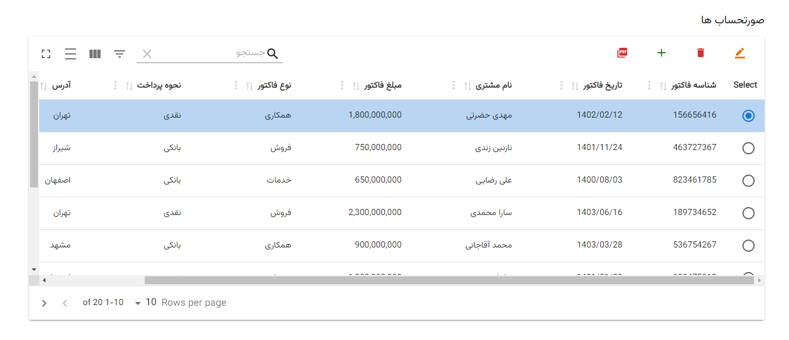

# SoratHesab 💼

## Invoice Management Web Application 📄

SoratHesab is a powerful web application for managing your invoices effortlessly! Keep your financial records organized with the click of a button. Read on to explore its features and the technologies behind it.



## Features 🚀

- ➕ **Create**: Easily add new invoices with all the necessary details – invoice number, date, customer name, amount, type, transportation, and address.

- 👁️‍🗨️ **Read**: Get a quick overview of your invoices, with handy filtering and searching options to find what you need.

- 🖋️ **Update**: Keep your data up-to-date by editing existing invoices.

- ❌ **Delete**: Remove invoices that are no longer needed, keeping your records tidy.

- 📥 **Export to PDF**: One-click export of your invoice list to a PDF file – perfect for printing or sharing.

## Technologies Used 🛠️

- **Frontend**:
  - 🌐 React: A JavaScript library for building engaging user interfaces.
  - 💅 Material-UI: A fantastic React UI framework for creating modern, responsive web apps.
  - 📊 Material-React-Table: Simplifies data table creation in Material-UI.
  - 🪙 react-query: Handles data fetching and state management in your React app.
  - 📜 jspdf: Generates PDF files effortlessly.
  - 📡 axios: A promise-based HTTP client for smooth API requests.
  - 🔥 Icons from Material-UI for a sleek user interface.

- **Backend**: (Check the `backend` folder for more details)
  - 🏢 A server-side component powered by Node.js, providing APIs and using JSON files as a database.

## Project Structure 🏗️

- **Frontend**: The main application code and UI components reside here.

- **backend**: Explore the `backend` folder for server-side code, Node.js, and the JSON database.

## Usage 🚗

1. 🧬 Clone the repository.

```
git clone https://github.com/Mahdi-Hazrati/SoratHesab.git
```


2. 📦 Install React app dependencies using `npm install`.
```bash
npm install
```

3. 📦 Install Node JS app dependencies using `npm install`.
```bash
cd backend
npm install
```

4. 🖥️ Run the backend Server, dive into the `backend` folder.
```
backend/  npm start
```

3. 🚀 Start the frontend with `npm start`.
```
/  npm start
```

4.  App Main Route
```
React app [Front-End] http://localhost:3000/
Node  app [Back-End ] http://localhost:3001/api
```

## Contributing 🤝

👏 Contributions are encouraged! Open issues or submit pull requests to make SoratHesab even better.

## License 📜

This project is licensed under the [MIT License](LICENSE).

---

Feel free to personalize this README further to give it your unique touch and provide a clear and engaging guide for anyone interested in using or contributing to SoratHesab.
Another project developed by Mehdi Happy coding! 😄