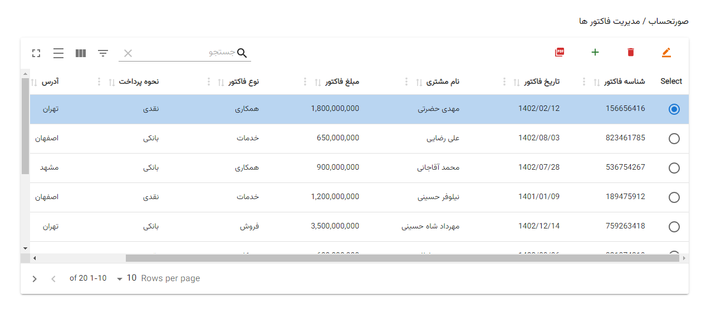

# SoratHesab Invoice Management React App



This is a React app for managing invoices. It allows you to view, add, edit, and delete invoice records.

## Summary

- Displays invoices in a table with pagination
- Allows adding, editing, and deleting invoice records
- Implements optimistic updates for a smooth UI
- Uses React Query for data fetching and caching
- Leverages Material UI for styling
- Exports invoice data to PDF

## Installation

1. Clone the repo

```
git clone https://github.com/Mahdi-Hazrati/SoratHesab.git
```

2. Install dependencies

```
npm install
```

3. Start the dev server

```
npm start
```

## Usage

The app displays invoices in a table with pagination. You can:

- View, search, and paginate invoices
- Add new invoices by clicking the + button
- Edit invoices by selecting a row and clicking the edit icon
- Delete invoices by selecting a row and clicking the delete icon  
- Export invoices to PDF by clicking the PDF icon

Edited invoices are optimistically updated for a smooth UI experience.

## Credits

This app was built with:

- [React](https://reactjs.org/) - Frontend framework
- [React Query](https://tanstack.com/query/latest) - Data fetching and caching
- [Material UI](https://mui.com/) - Styling and components
- [jspdf](https://github.com/LukSab/jspdf) - PDF generation

The data is mock sample data for demonstration. The app uses React Query's mutations to optimistically update the cache on edits without a real API.